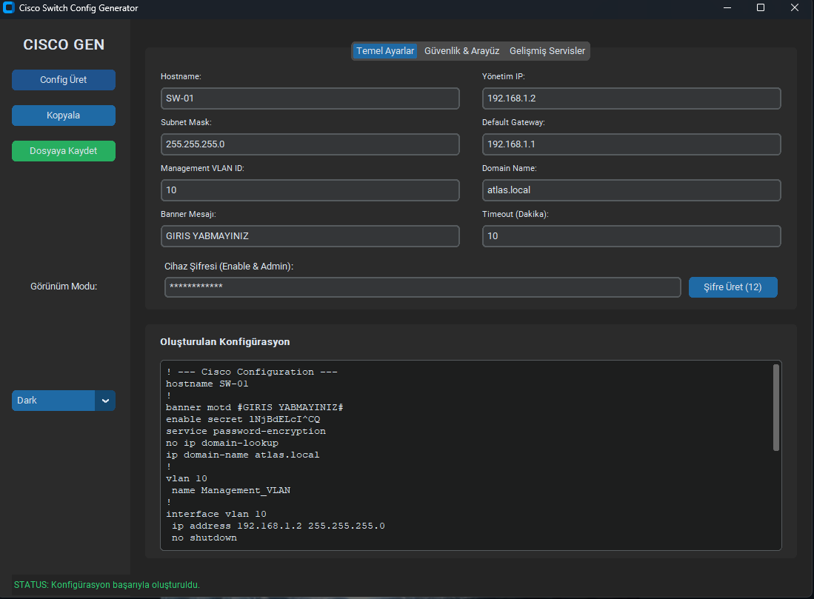
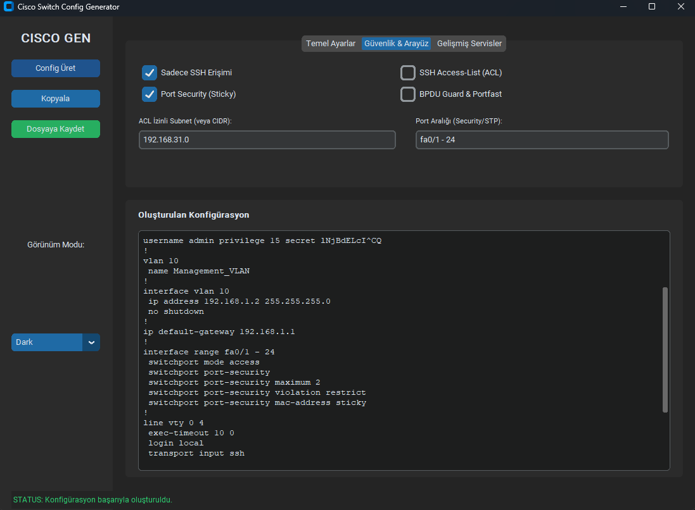

# Cisco Switch Config Generator 🚀

Modern, akıllı ve profesyonel bir Cisco Switch yapılandırma hazırlama aracı. Bu uygulama, ağ yöneticilerinin günlük rutinlerini hızlandırmak ve yapılandırma hatalarını minimize etmek için tasarlanmıştır.

## 📸 Uygulama Ekran Görüntüleri

### 1. Temel Ayarlar (Genel Yapılandırma)
Uygulamanın ana ekranı üzerinden hostname, IP, şifre ve yönetimsel ayarları kolayca yapabilirsiniz. Akıllı şifre üretici ile saniyeler içinde güçlü şifreler oluşturabilirsiniz.



### 2. Güvenlik ve Arayüz Ayarları
Port Security, SSH ACL ve STP korumalarını sekmeler üzerinden dinamik olarak yapılandırabilirsiniz. Girdiğiniz veriler otomatik olarak Cisco sentaksına normalize edilir.



## ✨ Öne Çıkan Özellikler

*   **Akıllı Giriş Doğrulama (Smart Validation):**
    *   **CIDR Desteği:** `/24` gibi girişleri otomatik olarak Cisco Wildcard maskesine çevirir.
    *   **Arayüz Normalizasyonu:** `fa01-24` gibi hatalı yazımları `fastethernet0/1 - 24` formatına düzeltir.
*   **Gelişmiş Güvenlik Katmanı:**
    *   **SSH Güvenliği:** 2048-bit RSA anahtarları ve otomatik ACL kısıtlaması.
    *   **Katman 2 Koruması:** DHCP Snooping, Dynamic ARP Inspection (DAI) ve IP Source Guard.
    *   **Port Güvenliği:** Sticky MAC ve violation kısıtlamaları.
*   **Modern Kullanıcı Deneyimi:**
    *   Modüler Tab (Sekme) yapısı.
    *   Dark / Light tema desteği.
    *   Güçlü şifre üretici (12 karakter, özel sembollü).
    *   Anlık durum çubuğu ve hata denetimi.

## 🚀 Kurulum

1.  Bilgisayarınızda Python 3.8+ yüklü olduğundan emin olun.
2.  Gerekli kütüphaneleri yükleyin:
    ```bash
    pip install -r requirements.txt
    ```
3.  Uygulamayı çalıştırın:
    ```bash
    python switch_config_generator.py
    ```

## 🛠️ Teknik Detaylar

*   **Dil:** Python
*   **Arayüz:** CustomTkinter (Modern UI)
*   **Kütüphaneler:** `ipaddress`, `re`, `secrets`, `customtkinter`

---
*Bu proje ağ mühendisliği süreçlerini otomatize etmek ve standartlaştırmak için geliştirilmiştir.*
